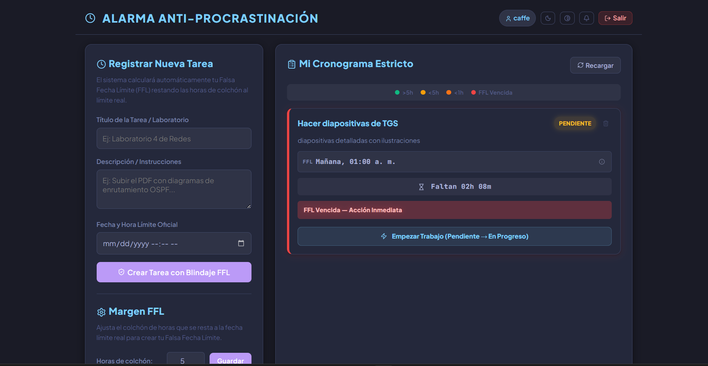
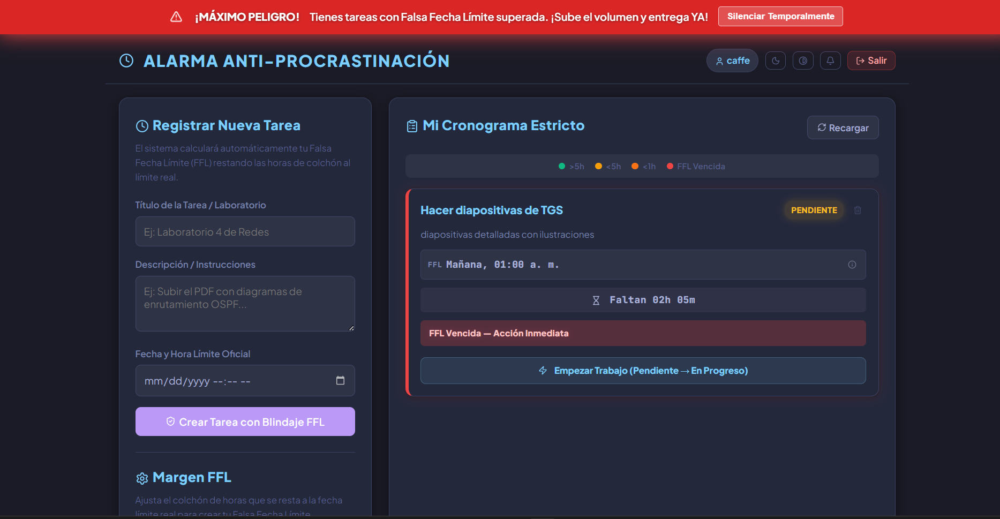

# Alarma Anti-Procrastinacion

Sistema de alerta y gestion estricta de plazos academicos con Falsa Fecha Limite (FFL), maquina de estados rigurosa y alarmas sonoras progresivas. Combate la postergacion cronica en la entrega de laboratorios y tareas.

[](https://github.com/MijailsDev/alarma-anti-procrastinacion/releases/tag/v1.0.0.0)

---

## Capturas




---

## 1. Arquitectura

El frontend Vanilla JS se sirve como PWA en el navegador **o** como ventana nativa de Electron. El backend Express con SQLite corre embebido dentro de la aplicacion de escritorio (sin necesidad de Docker ni servidor externo).

```
                            ┌───────────────────────────┐
 MODO NAVEGADOR            │  python3 -m http.server   │
 (PWA + Docker)            │  http://localhost:5000     │
                            └──────────┬────────────────┘
                                       │
 MODO ESCRITORIO           ┌──────────┴────────────────┐
 (Electron autocontenido) │  electron/main.js          │
                            │  ┌─ preload.js (contextBridge)
                            │  └─ BrowserWindow.loadFile()│
                            │  └─ import() dinamico con  │
                            │     pathToFileURL()        │
                            └──────────┬────────────────┘
                                       │
                           ┌───────────┴────────────┐
                           │   Express REST API      │
                           │   Puerto aleatorio      │
                           │   Cargado via import()  │
                           └───────────┬────────────┘
                                       │
                           ┌───────────┴────────────┐
                           │  SQLite (sql.js WASM)  │
                           │  %APPDATA%/alarma.db    │
                           └────────────────────────┘
```

### Componentes

- **Backend:** Node.js (ESM), Express, sql.js (SQLite WASM), JWT, bcrypt, Zod, Pino v8 logger
- **Frontend:** HTML5, CSS3, Vanilla JS (modulos ES), Web Audio API, Lucide icons
- **Escritorio:** Electron 28, context-isolation, contextBridge
- **Base de datos:** SQLite via sql.js, creada en `%APPDATA%/alarma-anti-procrastinacion/alarma.db` (Windows) o `~/.config/alarma-anti-procrastinacion/alarma.db` (Linux)

---

## 2. Guia de Inicializacion

### 2a. Aplicacion de escritorio (Electron) — RECOMENDADO

```bash
# Instalar dependencias (backend + Electron)
npm install

# Iniciar en modo desarrollo
npm start
```

Esto arranca:
1. El backend Express en un puerto libre aleatorio (spawneado por Electron)
2. La ventana nativa de Electron cargando `frontend/index.html`

### 2b. Modo PWA + Docker (alternativa)

```bash
# Backend con Docker
docker compose up -d

# Servir frontend estatico
python3 -m http.server 5000 --directory ./frontend
```

Abrir `http://localhost:5000` en el navegador.

### 2c. Solo backend (para desarrollo de API)

```bash
cd backend
npm install
npm run dev
```

---

## 3. Build para Windows

```bash
npm run build:win
```

El script `scripts/build.js` ejecuta automaticamente:
1. Instala solo dependencias de produccion del backend (`npm install --production` en `backend/`)
2. Compila el instalador NSIS via `electron-builder`

**Requisito:** En Linux, instalar `wine` para compilar el instalador NSIS:

```bash
sudo apt install wine
```

El instalador `.exe` se genera en `release/`. La base de datos se guarda automaticamente en `%APPDATA%/alarma-anti-procrastinacion/alarma.db` — sin problemas de permisos de escritura para el usuario.

### Notas sobre el empaquetado

- `asar: false` — los archivos se copian sin comprimir
- El backend se incluye como `extraResources` con su propio `node_modules` (produccion)
- Las rutas en produccion se resuelven via `process.resourcesPath`
- El `import()` dinamico del backend usa `pathToFileURL()` para compatibilidad con Windows

---

## 4. Reglas de Negocio

### A. Falsa Fecha Limite (FFL) Automatizada

Al registrar una tarea con su fecha limite real, el backend consulta el margen de amortiguacion del perfil (defecto: **5 horas**) y calcula:

```
FFL = Fecha Limite Real - margen_horas
```

Toda la interfaz, las alertas y las alarmas se rigen bajo esta FFL, forzando al estudiante a entregar con anticipacion real.

### B. Maquina de Estados Estricta

```
Pendiente  →  En Progreso  →  Enviada
```

Las transiciones son unidireccionales. No se permite saltar estados ni retroceder. Cualquier transicion invalida devuelve error `400`.

### C. Niveles de Alarma

| Tiempo restante para FFL | Nivel | Color | Frecuencia de alarma |
|---|---|---|---|
| > 5 h | Bajo | Verde | Sin sonido |
| 1-5 h | Moderado | Amarillo | Tono cada 10 s |
| < 1 h | Alto (Critico) | Naranja | Pitido cada 2.5 s |
| FFL vencida | MAXIMO PELIGRO | Rojo estroboscopico | Buzzer cada 0.8 s |

El boton **Silenciar** detiene la alarma por 3 minutos. Pasado ese tiempo, si la tarea sigue sin entregarse, la alarma se reactiva.

---

## 5. Estructura del Proyecto

```
├── electron/
│   ├── main.js            # Proceso principal de Electron
│   └── preload.js         # contextBridge (expone API_BASE al renderer)
├── backend/
│   ├── index.js           # Servidor Express
│   ├── src/
│   │   ├── errors.js
│   │   ├── logger.js
│   │   ├── logic.js
│   │   ├── validate.js
│   │   └── __tests__/
│   └── package.json
├── database/
│   └── schema.sql
├── frontend/
│   ├── index.html
│   ├── css/styles.css
│   ├── js/
│   │   ├── app.js
│   │   ├── config.js
│   │   └── formatDate.js
│   ├── icons/
│   └── sw.js
├── scripts/
│   ├── build.js            # Orquestador de build (iconos + deps + electron-builder)
│   ├── build.sh            # Alternativa bash
│   └── generate-icons.py   # Generador de iconos PNG
├── docker-compose.yml
├── electron-builder.yml    # Configuracion de empaquetado
└── package.json            # Raiz: Electron + backend deps
```

---

## 6. Comandos de Mantenimiento

```bash
# Resetear base de datos local
rm -f ~/.config/alarma-anti-procrastinacion/alarma.db   # Linux
rm -f "%APPDATA%/alarma-anti-procrastinacion/alarma.db" # Windows

# Ver logs del backend (modo Electron)
# Los logs aparecen en la consola donde se ejecuto npm start

# Docker (modo PWA)
docker compose logs -f
docker compose down
```

---

## Autor

**Mijail** — [mquispeq@unamad.edu.pe](mailto:mquispeq@unamad.edu.pe)

## Licencia

MIT © 2026. Ver [LICENSE](LICENSE.txt).
